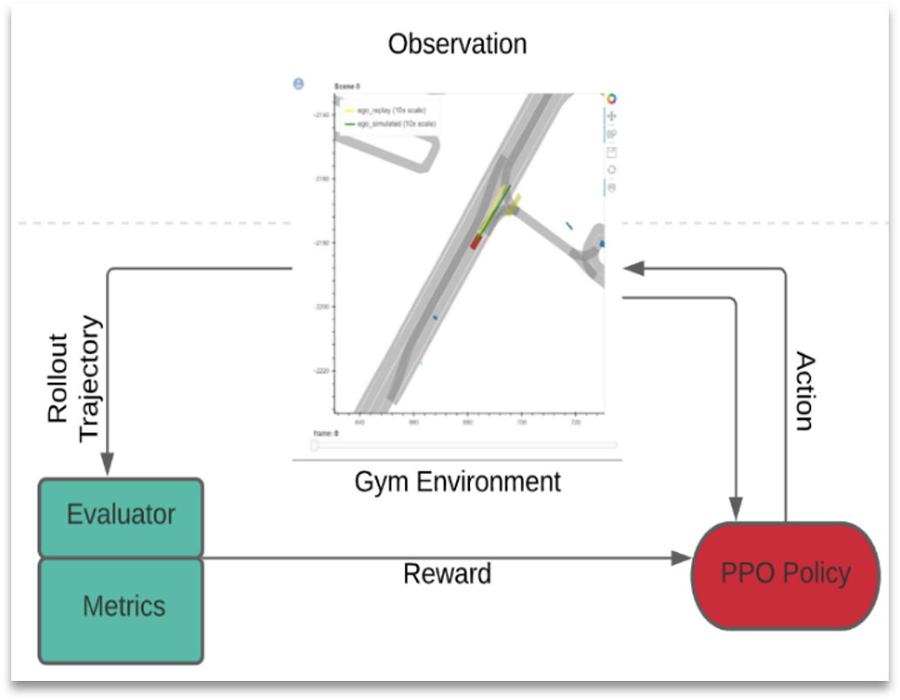
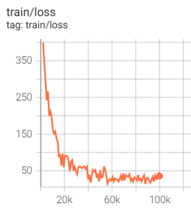

# Motion-Planning-using-Reinforcement-Learning

Developed model with Proximal Policy Optimization reinforcement learning algorithm to plan path for autonomous vehicle

#### Architecture

#### Scene

#### Results

